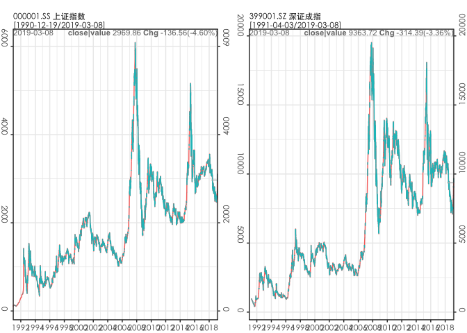

<!-- README.md is generated from README.Rmd. Please edit that file -->

# pedquant

pedquant(‘Public Economic Data and QUANTitative analysis’) provides an
interface to access public economic and financial data for ecnomic
research and quantitative analysis. The functions are grouped into three
main categories, economic data (ed\_.), market data (md\_.) and
quantitative analysis (pq\_.).

The data sources include [NBS](http://data.stats.gov.cn),
[FRED](http://data.stats.gov.cn), [Yahoo
finance](http://finance.yahoo.com), [163
Finance](http://quotes.money.163.com/stock#1b01), and [Sina
Finance](https://finance.sina.com.cn/futuremarket/) etc. The loaded data
have been carefully cleansed and provided in unified format. And
parameters to get data can be interactively set, therefore it’s very
easy to start.

Most functions in this package are designed to write minimum codes for
some common tasks in quantitative analysis process. It indirectly
depends on [quantmod](https://github.com/joshuaulrich/quantmod), and
provides some similar funnctions. But most data downloaded by this
package are dataframes, which can be easy manipulated in
[data.table](http://r-datatable.com/) or
[tidyverse](http://tidyverse.org) packages. And also easy handle in
[tidyquant package](https://github.com/business-science/tidyquant) for
more detailed financial analysis.

## Installation

You can install the developing version of pedquant from
[github](https://github.com/shichenXie/pedquant) with:

``` r
install.packages("pedquant")
```

## Example

The following examples show you how to download data and create charts.

``` r
library(pedquant)

## import eocnomic data
dat1 = ed_fred('GDPCA')
#> 1/1 GDPCA
head(dat1$GDPCA,3)
#>    symbol                        name       date value geo
#> 1:  GDPCA Real Gross Domestic Product 2009-01-01 15209  NA
#> 2:  GDPCA Real Gross Domestic Product 2010-01-01 15599  NA
#> 3:  GDPCA Real Gross Domestic Product 2011-01-01 15841  NA
#>                                unit
#> 1: Billions of Chained 2012 Dollars
#> 2: Billions of Chained 2012 Dollars
#> 3: Billions of Chained 2012 Dollars

dat2 = ed_nbs(geo_type='national', freq='quarterly', symbol='A010101')
head(dat2$A010101,3)
#>     symbol                name       date  value geo_code   geo unit
#> 1: A010101 国内生产总值_当季值 2009-04-01  83866       cn china 亿元
#> 2: A010101 国内生产总值_当季值 2009-07-01  89847       cn china 亿元
#> 3: A010101 国内生产总值_当季值 2009-10-01 100826       cn china 亿元

## import market data
dat3 = md_stock(c('^000001','^399001'), date_range = 'max') # from yahoo
#> 1/2 ^000001
#> 2/2 ^399001
head(dat3$`^000001`,3)
#>       symbol                name       date   open   high    low  close
#> 1: 000001.SS SSE Composite Index 1990-12-19  99.98  99.98  99.98  99.98
#> 2: 000001.SS SSE Composite Index 1990-12-20 104.39 104.39 104.39 104.39
#> 3: 000001.SS SSE Composite Index 1990-12-21 109.13 109.13 109.13 109.13
#>    close_adj volume unit
#> 1:     99.98      0  CNY
#> 2:    104.39      0  CNY
#> 3:    109.13      0  CNY

dat4 = md_stock(c('^000001','^399001'), date_range = 'max', source = '163')
#> 1/2 ^000001
#> 2/2 ^399001
head(dat4$`^000001`,3)
#>       symbol     name       date   open   high    low  close prev_close
#> 1: 000001.SS 上证指数 1990-12-19  96.05  99.98  95.79  99.98         NA
#> 2: 000001.SS 上证指数 1990-12-20 104.30 104.39  99.98 104.39      99.98
#> 3: 000001.SS 上证指数 1990-12-21 109.07 109.13 103.73 109.13     104.39
#>    change change_pct volume amount turnover cap_market cap_total unit
#> 1:     NA         NA   1260 494000       NA         NA        NA  CNY
#> 2:   4.41      4.411    197  84000       NA         NA        NA  CNY
#> 3:   4.74      4.541     28  16000       NA         NA        NA  CNY
```

``` r
# candstick chart
pq_plot(dat4$`^000001`, chart_type = 'candle', date_range = '1y')
#> $`000001.SS`
```


``` r

# adding technical indicators
pq_plot(dat4$`^000001`, chart_type = 'candle', date_range = '1y', addti = list(
    sma = list(n=50), macd=list()
))
```


    #> $`000001.SS`
    #> TableGrob (2 x 1) "arrange": 2 grobs
    #>    z     cells    name           grob
    #> p0 1 (1-1,1-1) arrange gtable[layout]
    #> p1 2 (2-2,1-1) arrange gtable[layout]
    
    # comparing prices
    pq_plot(dat4, multi_series = list(nrow=1, scales = 'free_y'))
    #> $multi_series



``` r

# performace trend
pq_plot(dat4, multi_series = list(nrow=1, scales = 'free_y'), perf = TRUE, date_range = 'ytd')
#> $multi_series
```


