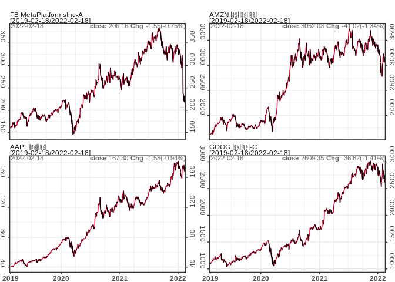

<!-- README.md is generated from README.Rmd. Please edit that file -->
pedquant
========

`pedquant` (Public Economic Data and QUANTitative analysis) provides an
interface to access public economic and financial data for economic
research and quantitative analysis. The functions are grouped into three
main categories,

-   ed\_\* (economic data) functions load economic data from
    [NBS](http://data.stats.gov.cn) and
    [FRED](http://data.stats.gov.cn);
-   md\_\* (market data) functions load stock prices from [Yahoo
    finance](http://finance.yahoo.com), stock prices and financial
    statements of SSE and SZSE shares from [163
    Finance](http://quotes.money.163.com/stock#1b01), and future prices
    from [Sina Finance](https://finance.sina.com.cn/futuremarket/) etc.
-   pq\_\* (quantitative analysis) functions create technical
    indicators, visualization charts and industrial index etc for time
    series data.

The functions in this package are designed to write minimum codes for
some common tasks in quantitative analysis process. Since the parameters
to get data can be interactively specify, it’s very easy to start. The
loaded data have been carefully cleansed and provided in a unified
format. More public data sources are still under cleansing and
developing.

`pedquant` package has advantages on multiple aspects, such as the
format of loaded data is a list of data frames, which can be easily
manipulated in [data.table](http://r-datatable.com/) or
[tidyverse](http://tidyverse.org) packages; high performance on speed by
use [data.table](http://r-datatable.com/) and
[TTR](https://github.com/joshuaulrich/TTR); and modern graphics by using
ggplot2. At this moment, `pedquant` can only handle EOD (end of date)
data. Similar works including
[tidyquant](https://github.com/business-science/tidyquant) or
[quantmod](https://github.com/joshuaulrich/quantmod), which are much
mature for financial analysis.

Installation
------------

-   Install the release version of `pedquant` from CRAN with:

<!-- -->

    install.packages("pedquant")

-   Install the developing version of `pedquant` from
    [github](https://github.com/shichenXie/pedquant) with:

<!-- -->

    devtools::install_github("shichenxie/pedquant")

Example
-------

The following examples show you how to import data and create charts.

    library(pedquant)
    ## import eocnomic data
    dat1 = ed_fred('GDPCA')
    #> 1/1 GDPCA
    dat2 = ed_nbs(geo_type='nation', freq='quarterly', symbol='A010101')

    ## import market data
    FAAG = md_stock(c('FB', 'AMZN', 'AAPL', 'GOOG'), date_range = 'max') # from yahoo
    #> 1/4 FB
    #> 2/4 AMZN
    #> 3/4 AAPL
    #> 4/4 GOOG
    INDX = md_stock(c('^000001','^399001'), date_range = 'max', source = '163')
    #> 1/2 ^000001
    #> 2/2 ^399001

    # candlestick chart with technical indicators
    pq_plot(INDX$`^000001`, chart_type = 'candle', date_range = '1y', addti = list(
        sma = list(n=50), macd=list()
    ))

    #> $`000001.SS`
    #> TableGrob (2 x 1) "arrange": 2 grobs
    #>    z     cells    name           grob
    #> p0 1 (1-1,1-1) arrange gtable[layout]
    #> p1 2 (2-2,1-1) arrange gtable[layout]

    # comparing prices
    pq_plot(FAAG, multi_series = list(nrow=2, scales = 'free_y'), date_range = '3y')
    #> $multi_series

Issues and Contributions
------------------------

This package still on the developing stage. If you have any issue when
using this package, please update to the latest version from github. If
the issue still exists, report it at [github
page](https://github.com/ShichenXie/pedquant/issues). Contributions in
any forms to this project are welcome.
